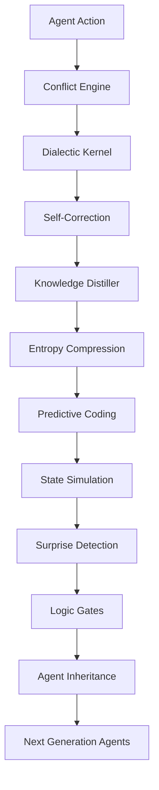

# 🌌 OpenAEON

### **AEON PROPHET — A Species-Level Evolution of the Logic Layer**

> *“Not a framework upgrade. A new form of intelligence architecture.”*

---


---


---

# 🧬 What is OpenAEON

**OpenAEON** is an experimental **AI cognition architecture** designed to evolve beyond traditional agent frameworks.

It transforms code from a static execution system into a **self-evolving logic organism**.

Instead of operating as:

```
Input → Process → Output
```

OpenAEON operates as:

```
Conflict → Resolution → Evolution
```

The system integrates three fundamental principles:

* **Dialectical reasoning**
* **Entropy reduction**
* **Predictive cognition**

Together they form a **self-correcting, self-improving intelligence loop**.

---

# 🚀 Core Capabilities

OpenAEON introduces four evolutionary layers to agent architecture.

| Layer                   | Function                   | Result                 |
| ----------------------- | -------------------------- | ---------------------- |
| **Conflict Engine**     | Self-adversarial reasoning | Better decisions       |
| **Knowledge Distiller** | Memory compression         | Long-term cognition    |
| **Predictive Coding**   | State simulation           | Fewer execution errors |
| **Logic Gates**         | Knowledge inheritance      | Cross-agent learning   |

---

# ⚔️ Conflict-Driven Engine

### Decision Layer Awakening

Traditional agents execute instructions linearly.

OpenAEON introduces **Dialectic Mode**:

```
Thesis      → Proposed action
Antithesis  → Internal critique
Synthesis   → Refined decision
```

Before execution, the system performs **internal logical combat**.

Benefits:

* Detects flawed reasoning
* Eliminates fragile plans
* Produces stronger solutions

---

# 🌀 Knowledge Distiller

### Memory Layer Evolution

Long-running AI agents suffer from **context overload**.

OpenAEON solves this using **entropy compression**.

When memory grows too large:

```
Logs → Patterns → Logic Axioms
```

Instead of storing raw history, the system stores **knowledge laws**.

Result:

* Memory grows **smaller**
* Knowledge grows **stronger**

---

# 👁 Predictive Coding

### Execution Layer Intuition

Before using tools, OpenAEON predicts the outcome.

Example workflow:

```
1. Predict system state
2. Execute tool
3. Compare prediction vs reality
```

If mismatch occurs:

```
Prediction ≠ Result
        ↓
Paradox Trigger
        ↓
Deep reasoning cycle
```

This prevents:

* infinite loops
* silent failure
* unstable reasoning chains

---

# ⚖️ Logic Gates

### Civilization-Level Knowledge Storage

Validated reasoning patterns are stored as **Logic Gates**.

Example:

```
LOGIC_GATES.md

Law of Prediction Integrity
Law of Dialectic Balance
Law of Entropy Compression
```

These gates act as **universal rules** for future agents.

New agents automatically inherit them.

Result:

```
Agents evolve collectively
```

---

# 🏗 Architecture Overview



---

# 🔬 Architecture Comparison

| Feature        | Standard Agent   | **OpenAEON**           |
| -------------- | ---------------- | ---------------------- |
| Logic Model    | Linear execution | Dialectical reasoning  |
| Memory         | Context stacking | Knowledge distillation |
| Error Handling | After execution  | Predictive detection   |
| Learning       | Session-based    | Cross-generation       |
| System Nature  | Tool             | **Evolving entity**    |
